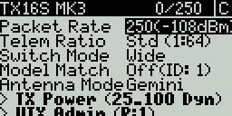
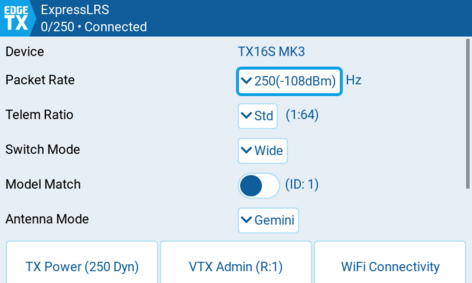
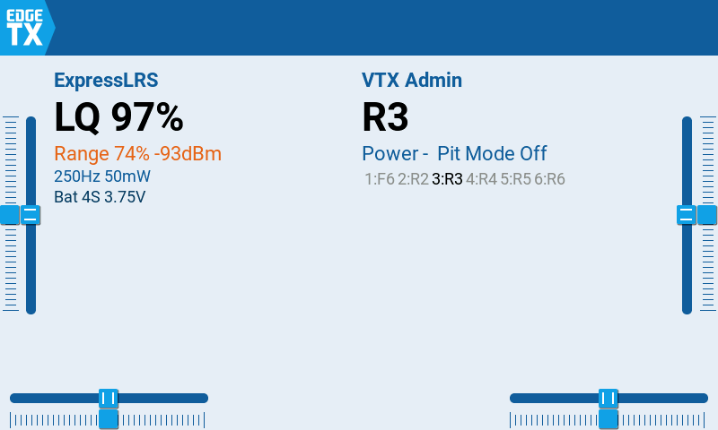
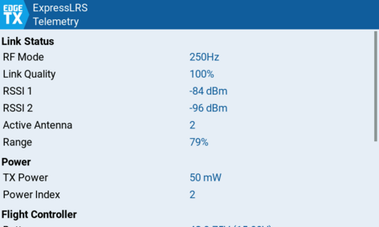
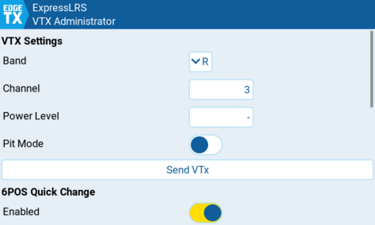

# ExpressLRS Lua Scripts

Lua configuration tool for ExpressLRS on EdgeTX radios. Works on both black & white LCD and color LCD radios.

The package also includes two color-LCD widgets: the **ELRS Telemetry Widget** and the **VTX Administrator Widget**.

## Features

- Configure packet rate, telemetry ratio, switch mode, model match, antenna mode, TX power, WiFi connectivity, and more
- Compatible with **ExpressLRS v3.0+**

## Installation

Copy the contents of the `src/` directory to the **root** of your radio's SD card, preserving the directory structure. Delete any old ELRS scripts (`ELRS.lua`, `elrsV2.lua`, `elrsV3.lua`, `expresslrs.lua` and their `.luac` counterparts) from `SCRIPTS/TOOLS/`.

When done, your SD card should contain:

```
SCRIPTS/
  ELRS/
    crsf.lua                  -- shared CRSF protocol library
  TOOLS/
    ExpressLRS/
      main.lua                -- entry point
      protocol.lua            -- CRSF protocol handling
      navigation.lua          -- folder navigation
      shim.lua                -- BW compatibility shim
      ui/
        lvgl.lua              -- color LCD UI (LVGL)
        lcd.lua               -- black & white LCD UI
WIDGETS/
  ELRSTelemetry/
    main.lua
    loadable.lua
    ui/
      ...
  ELRSVTXAdmin/
    main.lua
    loadable.lua
    presets.txt
    ui/
      ...
```

The shared library `SCRIPTS/ELRS/crsf.lua` is required by both widgets.

### Install with edgetx-cli

You can also install this package using [edgetx-cli](https://github.com/jurgelenas/edgetx-cli):

```sh
edgetx-cli pkg install ExpressLRS/Lua-Scripts@unified-lua-lsp
```

Use the `--eject` flag to automatically unmount the SD card after installation.

## ExpressLRS Configuration Tool

The main tool (`SCRIPTS/TOOLS/ExpressLRS/`) lets you configure your ExpressLRS transmitter and receiver settings directly from your radio.

<br/>



### Architecture

| Module | Purpose |
|--------|---------|
| `main.lua` | Entry point and run-loop orchestrator |
| `protocol.lua` | CRSF frame parsing, device discovery, parameter read/write |
| `navigation.lua` | Folder and device navigation stack |
| `shim.lua` | Polyfills for BW radios missing standard Lua functions |
| `ui/lvgl.lua` | Color LCD interface (LVGL dialogs, command pages, warnings) |
| `ui/lcd.lua` | BW LCD interface (text cursor, popups) |

## Widgets

Both widgets running side-by-side on the home screen:



## ELRS Telemetry Widget

The telemetry widget (`WIDGETS/ELRSTelemetry/`) displays real-time link statistics on your home screen: link quality, RSSI, range, RF mode, TX power, battery voltage, current, GPS, and flight mode. It supports multiple screen resolutions (800x480, 480x320, 480x272, 320x480, 320x240).



## VTX Administrator Widget

The VTX Administrator widget (`WIDGETS/ELRSVTXAdmin/`) provides control over your video transmitter settings -- band, channel, power level, and pit mode -- directly from your radio telemetry screen. It also supports 6POS quick change for rapid VTX channel switching via a 6POS switch.



## CRSF Simulator (Testing)

The `test/` directory contains a CRSF protocol simulator for development and testing without real hardware.

**File:** `test/SCRIPTS/CRSFSimulator/csrfsimulator.lua`

The simulator provides a packet-level mock of `crossfireTelemetryPop` and `crossfireTelemetryPush`, allowing the ELRS tool to exercise the full communication flow (device discovery, parameter loading, value writes, ELRS status) inside the EdgeTX simulator. Multiple scenarios are available to simulate different states such as normal operation, disconnected links, model mismatch, and more.

### How it works

When the tool detects it is running in the EdgeTX simulator (version string ends with `-simu`), `main.lua` automatically loads the simulator module from `/SCRIPTS/CRSFSimulator/csrfsimulator.lua` and patches the protocol's `pop`, `push`, and `hasCrsfModule` functions with the mock implementations.

To use the simulator, copy the `test/` directory contents onto the SD card alongside `src/` so that `SCRIPTS/CRSFSimulator/csrfsimulator.lua` is present. The simulator is ignored on real hardware.

### Scenarios

The simulator supports multiple test scenarios, configurable via the `config.scenario` variable at the top of the file:

| Scenario | Description |
|----------|-------------|
| `normal` | TX + RX connected. Happy path with full telemetry and all parameters. |
| `no_telemetry` | TX present but no RX telemetry. Shows "No telemetry" state. |
| `reconnect` | Starts disconnected, transitions to connected after ~5 seconds. |
| `model_mismatch` | TX + RX connected with Model ID mismatch flag. Triggers warning dialog. |
| `armed` | TX + RX connected with "is Armed" warning flag. |
| `slow_loading` | Parameter reads delayed by ~2 seconds each. Tests loading UI states. |
| `no_module` | No CRSF module found. Triggers "No Module Found" error dialog. |

## Compatibility

| Radio type | Firmware | ExpressLRS |
|------------|----------|------------|
| Black & white LCD | EdgeTX 2.11.6+, 2.12.1+, or 3.0+ | v3.0+ |
| Color LCD | EdgeTX 2.11.6+, 2.12.1+, or 3.0+ | v3.0+ |
